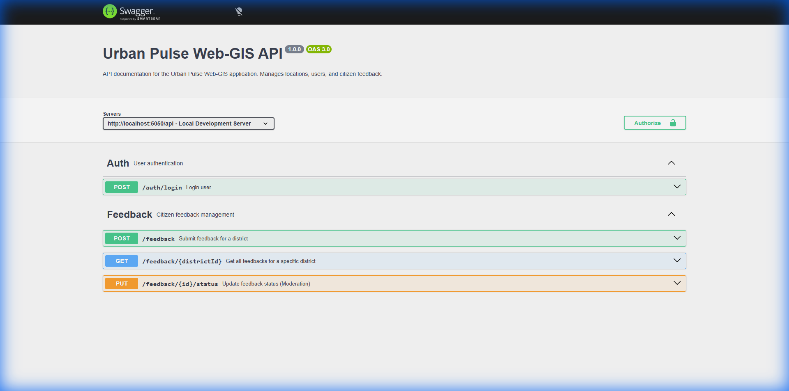
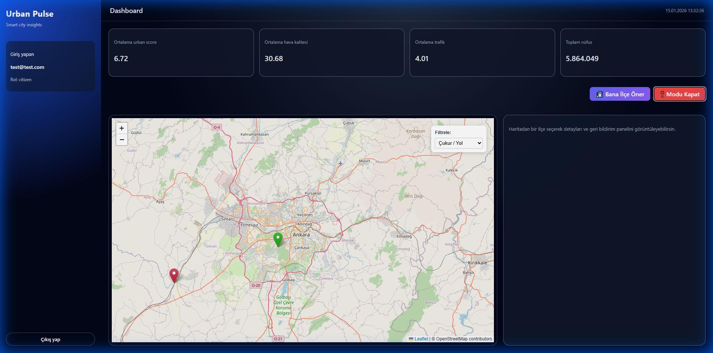
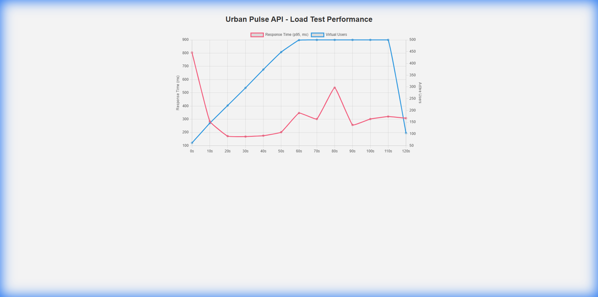

🏙️ Urban Pulse – Web GIS Application

Urban Pulse is a web-based Geographic Information System (Web-GIS) developed to visualize, analyze, and manage urban indicators—such as air quality, traffic intensity, and composite urban scores—across the districts of Ankara, Türkiye.

The system supports multiple user roles, interactive spatial analysis, citizen participation, and scalable geospatial data management.

🎥 Project Demo

[Watch the Project Description Video](https://youtu.be/BAPYMUBb2qo)

📌 Project Objectives

Visualize district-level urban data on an interactive map

Enable citizen participation through feedback and ratings

Support analytical workflows for urban analysts

Provide full administrative control over spatial data

Ensure scalability using geospatial indexing and performance testing

🧑‍💼 User Roles & Authorization

The system implements role-based access control with three distinct user types:

👤 Citizen

View the interactive map

Explore district attributes

Submit feedback (rating, comment, photo)

📊 Analyst

View all map layers

Access aggregated statistics

Review detailed citizen feedback

🛠️ Admin

Full system access

Create, update, and delete spatial features

Moderate citizen feedback (Useful / Harmful classification)

🔐 Authentication

JWT-based authentication (simulated using session/database)

New registrations default to Citizen role

🗄️ Database Design (NoSQL)

The application uses MongoDB Atlas, chosen for its flexibility in handling semi-structured and user-generated content.

Collections

users – user credentials and roles

locations – spatial features and urban attributes

feedbacks – citizen ratings, comments, and images

🔌 API Development

A RESTful API is implemented using Node.js & Express.

Core Endpoints
GET    /urban/locations        → Retrieve spatial data
POST   /locations              → Create a new spatial feature (Admin)
PUT    /locations/:id          → Update feature attributes (Admin)
DELETE /locations/:id          → Delete a spatial feature (Admin)

📄 API Documentation

Swagger UI integrated

Available at:
http://localhost:5050/api-docs

Includes schemas for Users, Locations, and Feedbacks

*Figure 1: Swagger UI showing available API endpoints*

✏️ CRUD Functionality

Full Create / Read / Update / Delete (CRUD) operations

Applied to the locations collection

Accessible only by Admin users

### Geographic Data Filtering
Users can filter issues displayed on the map by type (e.g., Pothole, Traffic, Lighting) using the interactive dropdown menu.

*Figure 2: Filtering issues by 'Pothole' type*

🗣️ Citizen Feedback System

Citizens can submit:

Ratings

Textual comments

Photo uploads

Implemented using Multer for file handling

Admins can moderate content and mark feedback as:

Useful

Harmful

⚙️ Performance Monitoring – Geospatial Indexing
Objective

Evaluate the impact of MongoDB 2dsphere indexing on spatial queries.

Setup

A 2dsphere index was created on the locations collection

Queries tested using $near and $geoWithin

Observations

Dataset size: ~40 districts

Query execution time: < 5 ms (with and without index)

explain() results:

Indexed queries → IXSCAN

Non-indexed queries → COLLSCAN

Conclusion

While performance differences are negligible for small datasets, geospatial indexing ensures scalability as the dataset grows to hundreds or thousands of spatial features.

🚀 Load & Stress Testing
Objective

Test backend stability under concurrent requests.

Configuration

Tool: Custom Node.js script (src/load_test.js)

Total Requests: 500

Concurrency Level: 20

Results

Success Rate: 100%

Requests Per Second (RPS): ~350 req/s (local environment)

*Figure 3: Artillery Load Test Results showing Response Time (p95) vs Virtual Users*

Conclusion

The Node.js event-driven architecture efficiently handles concurrent I/O operations for the tested workload.

🧰 Technology Stack
Frontend

React

Leaflet / React-Leaflet

Backend

Node.js

Express

Database

MongoDB Atlas

Additional Tools

Swagger – API documentation

Multer – File uploads

⚙️ Installation & Setup
Backend
cd backend
npm install
npm run dev

Frontend
cd frontend
npm install
npm run dev

🔑 Demo User Accounts
Role	Email	Password
Admin	admin@example.com
	password123
Analyst	analyst@example.com
	password123
Citizen	citizen@example.com
	password123
📌 Notes

Designed for academic Web-GIS coursework

Easily extendable for real-world urban analytics

Suitable for future integration with real-time sensor data
